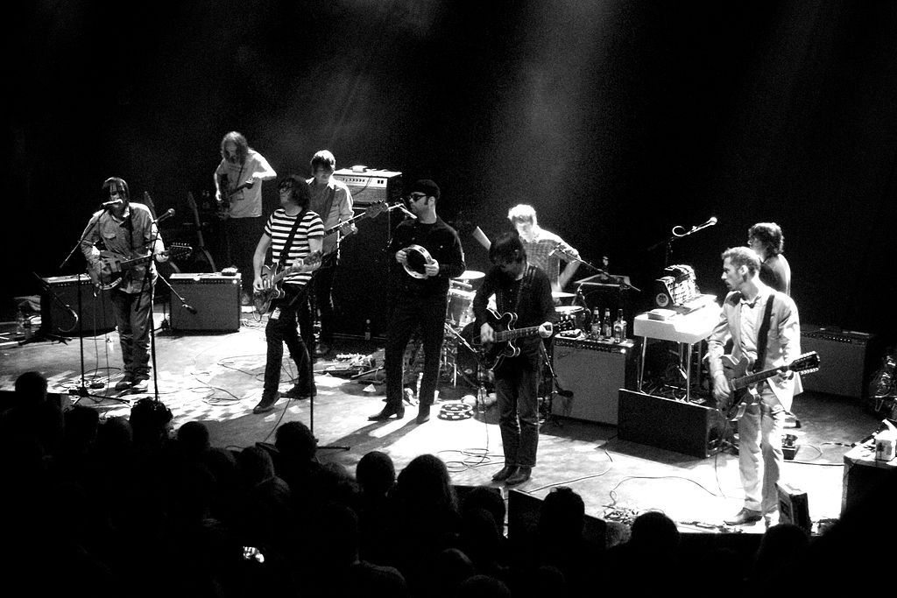

# My Favorite Band #
> The Brian Jonestown Massacre (BJM for short) are a band formed in San Francisco, CA in 1990. Their music encompasses a wide variety of genres, including psychedelic rock, shoegaze, garage rock, folk rock, neo-psychedelia, blues rock and country rock. Anton Newcombe has been the only constant member since the bands founding. The BJM was once notorious for its internal drama between its members, causing many members to leave the band.

## Influences #
The BJM draws on a wide variety of influences. Their first two records, "Methodrone" "Spacegirl and other Favorites", draw influence from shoegaze bands such as:
* Galaxie 500
* Spacemen 3
* My Bloody Valentine

Their following records draw from bands that were integral to the rock and psychedelia scenes from the 1960's, such as:
* The Rolling Stones
* The Velvet Underground
* The Beatles
* Donovan
* Bob Dylan

Later BJM records signaled a return to their roots, with many of their albums returning to the shoegaze, goth and dream pop sound that had influenced them so heavily.

## Discography ##
The BJM are known for their prolific discography, and they have released multiple full-length releases in the same year more than once.
* Methodrone (1995)
* Spacegirl and Other Favorites (1995)
* Take It from the Man! (1996)
* Their Satanic Majesties' Second Request (1996)
* Thank God for Mental Illness (1996)
* Give It Back! (1997)
* Strung Out in Heaven (1998)
* Bravery Repetition and Noise (2001)
* ...And This Is Our Music (2003)
* My Bloody Underground (2008)
* Who Killed Sgt. Pepper? (2010)
* Aufheben (2012)
* Revelation (2014)
* Musique de Film Imaginé (2015)
* Mini Album Thingy Wingy (2015)
* Third World Pyramid (2016)
* Don't Get Lost (2017)
* Something Else (2018)
* The Brian Jonestown Massacre (2019)
* Fire Doesn't Grow on Trees (2022)
* The Future Is Your Past (2023)

[Click here](https://youtu.be/lAueqTRSVp4) to explore my personal favorite album by the BJM.